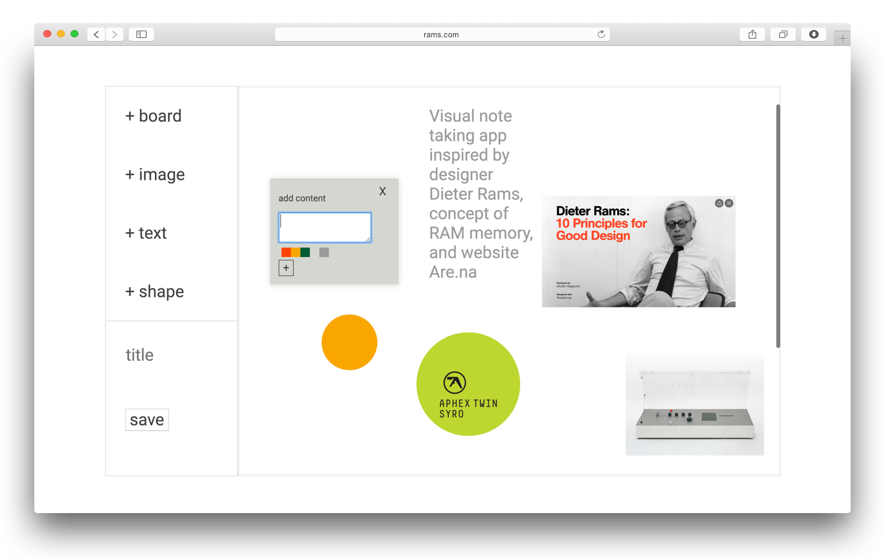
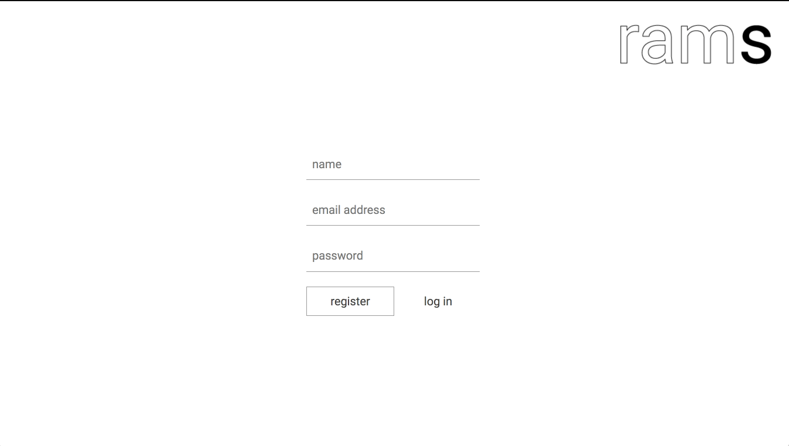
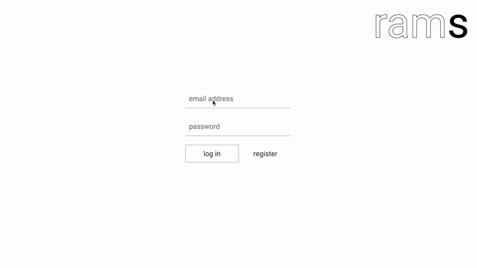
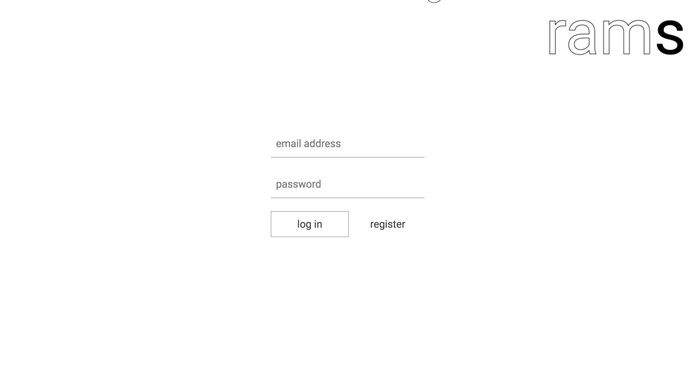

# Rams
> Visual note-taking app built out of <a target="_blank" href="https://github.com/eeeeoo/ram-backend">Rails back-end API</a>, React front-end, and stying using vanilla CSS. 

#### Rams is a visual note-taking app inspired by the color schemes and simple design by designer Dieter Rams that uses shapes, colors, and text to help you think and create. Users can log in to view prior visualizations, create multiple notes, and save for later use. 



## Installation
```sh
1. cd rams-backend
2. run `rails s -p 3001`
3. open a second tab in your terminal
4. cd rams-frontend
5. git checkout `react-v`
6. run npm start
7. it will ask if you want to run on a different port other than port 3000 currently hosting your rails server
8. Y for yes
9. Site should be accessible on `http://localhost:3000/` if you have no other apps running in the background.
```
## Demo

**1.Login (Auth)**




**2.Making Boards as Notes with Text, Images, and Shapes**




**3.Looking at Saved Boards**




## Release History
* 0.1.0
    * First official release

## Meta

* **Jee Yoon Lee** – [github.com/eeeeoo](https://github.com/eeeeoo)

## Contributing

1. Fork it (<https://github.com/eeeeoo/ram-frontend/fork>)
2. Create your feature branch (`git checkout -b feature/fooBar`)
3. Commit your changes (`git commit -am 'Add some fooBar'`)
4. Push to the branch (`git push origin feature/fooBar`)
5. Create a new Pull Request
